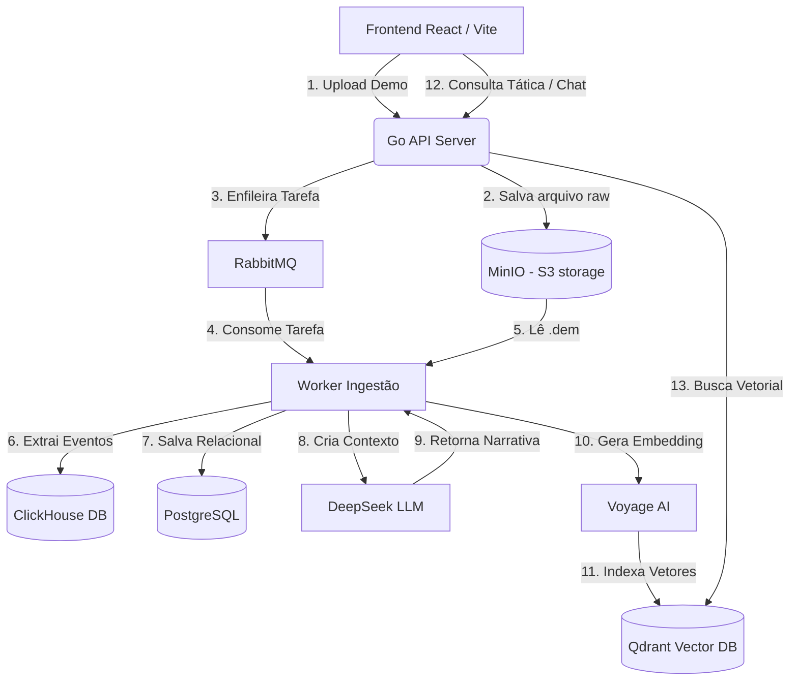

# MagicStrike 🚀

MagicStrike é uma plataforma inteligente e de alta performance para **análise tática e busca semântica de replays de Counter-Strike 2 (CS2)**. 

Ao fazer o upload de arquivos de demo (`.dem`), a plataforma realiza uma análise profunda de cada evento da partida, gerando narrativas automáticas para cada round por meio de Inteligência Artificial (DeepSeek) e enriquecendo a busca tática através de embeddings semânticos (Voyage AI) em um banco vetorial (Qdrant).

---

## 🏗️ Arquitetura do Sistema

O projeto foi construído sob uma arquitetura de microsserviços monorepo dividida em duas grandes partes:
1. **`app/`**: Backend resiliente escrito em **Go**, seguindo os princípios de **Arquitetura Hexagonal (Ports & Adapters)**.
2. **`web/`**: Single Page Application (SPA) em **React** + **Vite** com **TypeScript** e **TailwindCSS**.



---

## 🛠️ Stack Tecnológica

### Backend (`app/`)
* **Linguagem:** Go (Golang) — para concorrência de alta performance e processamento eficiente de arquivos binários pesados.
* **Parser de Demos:** [demoinfocs-golang/v5](https://github.com/markus-wa/demoinfocs-golang) — parser robusto e otimizado para extração de dados e telemetria de replays de CS2.
* **Armazenamento Híbrido:**
  * **PostgreSQL:** Armazena dados relacionais, sessões de usuários (passwordless) e metadados de partidas.
  * **ClickHouse:** Banco colunar OLAP de extrema performance usado para armazenar a telemetria bruta e os eventos granulares dos rounds (Kills, Plants, Utility, etc.).
  * **Qdrant:** Banco vetorial para busca semântica em linguagem natural das narrativas geradas por IA.
  * **MinIO (S3 API):** Armazenamento de objetos local para arquivos `.dem`.
* **Mensageria:** **RabbitMQ** para processamento assíncrono e desacoplado através de Workers.
* **Provedores de IA:** 
  * **DeepSeek:** Geração de narrativas detalhadas e análise tática automática por round.
  * **Voyage AI:** Modelos de embeddings otimizados para busca semântica contextualizada.

### Frontend (`web/`)
* **Framework:** React + Vite (Rápido e otimizado para desenvolvimento e produção).
* **Linguagem:** TypeScript (Tipagem estática para robustez).
* **Estilização:** TailwindCSS (Design fluído, moderno e responsivo).
* **Rotas e Validação:** React Router DOM & Valibot (Validação leve de formulários e schemas).

---

## 💡 Ganhos de se usar essa Arquitetura

1. **Desacoplamento e Resiliência (RabbitMQ + Workers):** 
   O parser de demos de CS2 é um processo intensivo em CPU. Ao delegar essa tarefa a workers assíncronos via fila de mensagens, a API HTTP principal permanece extremamente leve e responsiva sob carga.
2. **Armazenamento Especializado (Postgres + ClickHouse + Qdrant):**
   * Em vez de usar um único banco de dados para propósitos diferentes, usamos o **PostgreSQL** para o que ele é melhor (transações ACID relacionais rápidos e autenticação).
   * O **ClickHouse** processa agregados analíticos e consultas em milhões de eventos com frações de segundo de latência.
   * O **Qdrant** viabiliza consultas semânticas complexas (ex: *"rounds onde o time perdeu a vantagem numérica mas conseguiu fazer o clutch no retake do bomb B"*).
3. **Clean Architecture / Hexagonal (Ports & Adapters):**
   A lógica de domínio da aplicação é puramente em Go e isolada de frameworks ou drivers. Se você decidir substituir o PostgreSQL por MySQL, ou o Qdrant pelo pgvector, basta reimplementar o Adapter na camada `adapters/out` sem afetar a lógica central.

---

## 🚀 Como Rodar o Projeto Localmente

### Pré-requisitos
* **Go 1.22+**
* **NodeJS 18+**
* **Docker / Podman** + **Docker Compose**
* **Make**

---

### Passo 1: Subir a Infraestrutura (Bancos e Serviços)

Na raiz do repositório ou dentro da pasta `/app`, inicialize os contêineres:
```bash
cd app
make infra-up
```
Isso iniciará o Postgres, ClickHouse, RabbitMQ, MinIO e Qdrant localmente.

#### Painéis de Administração Locais

| Serviço | Interface Web / Porta | Usuário | Senha | Banco Padrão |
| :--- | :--- | :--- | :--- | :--- |
| **PostgreSQL** | `localhost:5432` | `postgres` | `postgres` | `magicstrike` |
| **RabbitMQ** | [http://localhost:15672](http://localhost:15672) | `guest` | `guest` | `-` |
| **MinIO (S3)** | [http://localhost:9001](http://localhost:9001) | `minioadmin` | `minioadmin` | `magicstrike-demos` |
| **ClickHouse** | [http://localhost:8123/play](http://localhost:8123/play) | `default` | `test` | `magicstrike` |
| **Qdrant** | [http://127.0.0.1:6333/dashboard](http://localhost:6333/dashboard) | `-` | `-` | `round_narratives` |

---

### Passo 2: Configurar Variáveis de Ambiente

Crie os arquivos `.env` baseados nos exemplos:

1. **No Backend (`app/`):**
   ```bash
   cd app
   cp .env.example .env
   ```
   Adicione suas chaves de IA caso possua:
   ```env
   DEEPSEEK_API_KEY=sua-chave-aqui
   VOYAGE_API_KEY=sua-chave-aqui
   ```

2. **No Frontend (`web/`):**
   ```bash
   cd ../web
   cp .env.example .env
   ```
   *(Já vem pré-configurado para apontar para `http://localhost:8080/api/v1`)*.

---

### Passo 3: Iniciar o Backend

1. Compile e teste a aplicação:
   ```bash
   cd ../app
   make test
   make build
   ```
2. Inicialize o servidor da **API HTTP**:
   ```bash
   make run-api
   ```
3. Em outro terminal, inicialize o **Worker** (para consumir as tarefas do RabbitMQ):
   ```bash
   ./bin/worker -mode consumer
   ```

---

### Passo 4: Iniciar o Frontend

1. Instale as dependências:
   ```bash
   cd ../web
   npm install
   ```
2. Inicie o servidor de desenvolvimento:
   ```bash
   npm run dev
   ```

Acesse a URL gerada (por padrão [http://localhost:5173](http://localhost:5173)) para começar a utilizar a interface do MagicStrike!
