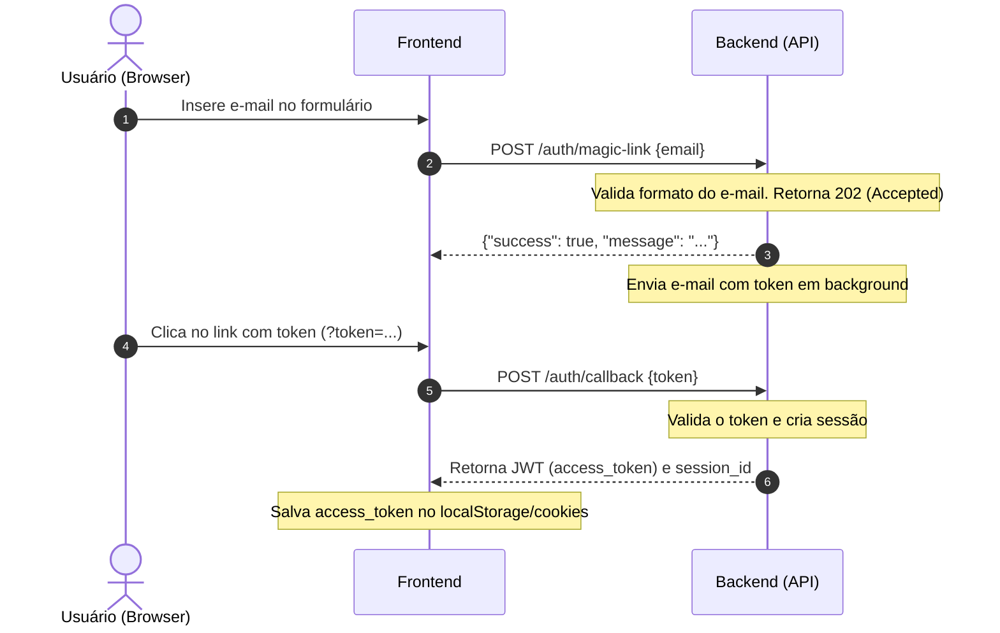
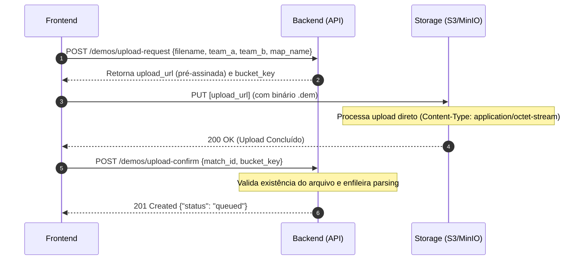

# Guia de Integração Frontend — MagicStrike 🚀

Este documento fornece especificações detalhadas e regras de negócio essenciais para integrar o frontend com a API do **MagicStrike**, facilitando um alinhamento completo entre as duas camadas do projeto.

---

## 🔐 1. Fluxo de Autenticação (Passwordless & JWT)

A API utiliza autenticação sem senha (passwordless) com Magic Link e controle de sessões via tokens JWT.

### Visão Geral do Fluxo



---

## 📂 2. Fluxo de Upload de Demos (.dem)

Para evitar gargalos de processamento, o backend não recebe arquivos diretamente. Em vez disso, o frontend solicita uma URL segura e pré-assinada para fazer o upload do replay direto no serviço de armazenamento (MinIO/S3).



---

## 🌐 3. Detalhamento dos Endpoints

> [!IMPORTANT]
> Todos os endpoints da API possuem o prefixo de rota base: `/api/v1`

### 1. Solicitar Magic Link
* **Rota**: `POST /auth/magic-link`
* **Autenticação**: Não requer
* **Payload de Entrada**:
  ```json
  {
    "email": "test@example.com"
  }
  ```
* **Regras de Negócio e Validação**:
  * O campo `email` é obrigatório, deve respeitar a estrutura de e-mail e possuir no máximo `254` caracteres.
  * Para evitar ataques de **enumeração de contas**, a API **sempre retornará HTTP `202 Accepted`** mesmo que o e-mail não exista na base de dados.
* **Payload de Retorno (202 Accepted)**:
  ```json
  {
    "success": true,
    "message": "If the email exists, a magic link has been sent."
  }
  ```

---

### 2. Validar Token e Fazer Login
* **Rota**: `POST /auth/callback`
* **Autenticação**: Não requer
* **Payload de Entrada**:
  ```json
  {
    "token": "9aa0c2a993879ed15c91b65569066c1ca59d2ec27cac30a598f0a2bb0eadb527"
  }
  ```
* **Regras de Negócio e Validação**:
  * O `token` é obrigatório.
  * Tokens possuem expiração curta. Se o token for inválido ou já tiver expirado, retorna `401 Unauthorized`.
* **Payload de Retorno (200 OK)**:
  ```json
  {
    "success": true,
    "data": {
      "access_token": "eyJhbGciOiJIUzI1NiIsInR5cCI6IkpXVCJ9...",
      "session_id": "01KTAP0QYEDTTHKHDCA1BMD26W",
      "user": {
        "id": "01KTAM9NZ3QF5V2N9H62R05JM7",
        "username": "insanifan",
        "email": "test@example.com",
        "avatar": "https://example.com/avatar.jpg",
        "points": 0,
        "blocked": false,
        "created_at": "2026-06-04T22:31:30-03:00",
        "updated_at": "2026-06-04T22:31:30-03:00"
      },
      "expires_at": "2026-06-12T01:23:24Z"
    }
  }
  ```

---

### 3. Atualizar Token JWT (Refresh)
* **Rota**: `POST /auth/refresh`
* **Autenticação**: Requer JWT válido no cabeçalho `Authorization: Bearer <token>`
* **Payload de Entrada**: Nenhum. O ID da sessão é extraído das claims do JWT atual.
* **Regras de Negócio e Validação**:
  * Se o token JWT no cabeçalho já expirou ou é inválido, o middleware bloqueia a requisição retornando `401`.
* **Payload de Retorno (200 OK)**:
  * Mesmo formato de dados do `/auth/callback`, trazendo um novo `access_token` com validade renovada por mais 7 dias.

---

### 4. Logout / Encerrar Sessão
* **Rota**: `DELETE /auth/session`
* **Autenticação**: Requer JWT válido no cabeçalho `Authorization: Bearer <token>`
* **Payload de Entrada**: Nenhum.
* **Regras de Negócio e Validação**:
  * Encerra a sessão no banco e coloca o identificador único da sessão (`session_id`) na blocklist temporária em memória no servidor, invalidando o uso do JWT atual imediatamente.
* **Payload de Retorno (204 No Content)**:
  * Sem conteúdo no corpo.

---

### 5. Solicitar Upload de Demo
* **Rota**: `POST /demos/upload-request`
* **Autenticação**: Requer JWT
* **Payload de Entrada**:
  ```json
  {
    "match_id": "01KTAP1DS10RT0VRSBD62Q0MQB", // Opcional
    "filename": "mibr-vs-lynn-vision-m1-anubis-p2.dem",
    "md5_hash": "5d41402abc4b2a76b9719d911017c592", // Opcional
    "team_a": "MIBR",
    "team_b": "Lynn Vision",
    "map_name": "de_anubis"
  }
  ```
* **Regras de Negócio e Validação**:
  * Os campos `filename`, `team_a`, `team_b` e `map_name` são obrigatórios.
  * O backend faz uma validação preventiva. Se for passado `md5_hash` e este arquivo já foi enviado, o servidor retorna `409 Conflict`.
* **Payload de Retorno (200 OK)**:
  ```json
  {
    "upload_url": "http://127.0.0.1:9002/magicstrike-demos/uploads/01KTAM9NZ3QF5V2N9H62R05JM7/01KTAP1DS10RT0VRSBD62Q0MQB/mibr-vs-lynn-vision-m1-anubis-p2.dem?X-Amz-Algorithm=AWS4-HMAC-SHA256&...",
    "bucket_key": "/uploads/01KTAM9NZ3QF5V2N9H62R05JM7/01KTAP1DS10RT0VRSBD62Q0MQB/mibr-vs-lynn-vision-m1-anubis-p2.dem",
    "expires_at": "2026-06-05T01:38:24Z",
    "match_id": "01KTAP1DS10RT0VRSBD62Q0MQB"
  }
  ```

---

### 6. Confirmar Upload da Demo
* **Rota**: `POST /demos/upload-confirm`
* **Autenticação**: Requer JWT
* **Payload de Entrada**:
  ```json
  {
    "match_id": "01KTAP1DS10RT0VRSBD62Q0MQB",
    "bucket_key": "/uploads/01KTAM9NZ3QF5V2N9H62R05JM7/01KTAP1DS10RT0VRSBD62Q0MQB/mibr-vs-lynn-vision-m1-anubis-p2.dem"
  }
  ```
* **Regras de Negócio e Validação**:
  * Este endpoint deve ser chamado apenas **após** o frontend receber a resposta `200` da requisição `PUT` feita à `upload_url`.
  * O backend verifica se o arquivo está persistido no bucket. Se não estiver, retorna `404 Not Found` (com corpo no padrão RFC 7807).
  * Se o arquivo existir, altera o status da partida para `pending` e insere uma mensagem na fila RabbitMQ para o worker processar e fazer o parse.
* **Payload de Retorno (201 Created)**:
  ```json
  {
    "status": "queued",
    "match_id": "01KTAP1DS10RT0VRSBD62Q0MQB"
  }
  ```

---

### 7. Listar Partidas (Matches)
* **Rota**: `GET /matches`
* **Autenticação**: Requer JWT
* **Parâmetros Query**:
  * `limit`: Opcional. Número de itens por página. Entre `1` e `50` (padrão `20`).
  * `offset`: Opcional. Ponto de partida. Deve ser positivo (padrão `0`).
* **Regras de Negócio**:
  * Retorna apenas as partidas associadas ao usuário atualmente autenticado.
* **Payload de Retorno (200 OK)**:
  ```json
  {
    "success": true,
    "data": {
      "matches": [
        {
          "id": "01KTAP1DS10RT0VRSBD62Q0MQB",
          "user_id": "01KTAM9NZ3QF5V2N9H62R05JM7",
          "status": "processed",
          "team_a": "MIBR",
          "team_b": "Lynn Vision",
          "demo_md5": "5d41402abc4b2a76b9719d911017c592",
          "score_a": 13,
          "score_b": 6,
          "total_rounds": 19,
          "map_name": "de_anubis",
          "created_at": "2026-06-05T01:23:24Z",
          "updated_at": "2026-06-05T01:25:00Z"
        }
      ],
      "limit": 20,
      "offset": 0,
      "count": 1
    }
  }
  ```

---

### 8. Obter Detalhes de Partida Única
* **Rota**: `GET /matches/{id}`
* **Autenticação**: Requer JWT
* **Regras de Negócio**:
  * Valida a propriedade da partida. Se o usuário autenticado não for o criador da partida requisitada, o backend retorna `404 Not Found` por questões de segurança (impedindo descoberta de IDs válidos).
* **Payload de Retorno (200 OK)**:
  ```json
  {
    "success": true,
    "data": {
      "id": "01KTAP1DS10RT0VRSBD62Q0MQB",
      "user_id": "01KTAM9NZ3QF5V2N9H62R05JM7",
      "status": "processed",
      "team_a": "MIBR",
      "team_b": "Lynn Vision",
      "score_a": 13,
      "score_b": 6,
      "total_rounds": 19,
      "map_name": "de_anubis",
      "created_at": "...",
      "updated_at": "..."
    }
  }
  ```

---

### 9. Iniciar Conversa / Novo Chat
* **Rota**: `POST /chat`
* **Autenticação**: Requer JWT
* **Payload de Entrada**:
  ```json
  {
    "match_ids": ["01KTAP1DS10RT0VRSBD62Q0MQB"],
    "question": "Porque o insani tem tão pouco HS?"
  }
  ```
* **Regras de Negócio e Validação**:
  * O array `match_ids` deve conter no mínimo `1` partida e no máximo `20` partidas.
  * O campo `question` é obrigatório e aceita no máximo `500` caracteres.
  * O backend faz uma busca inteligente usando RAG no ClickHouse ou Qdrant (retornado em `source`) e formula a resposta utilizando IA.
* **Payload de Retorno (201 Created)**:
  ```json
  {
    "success": true,
    "data": {
      "session_id": "01KTAP883DM1CCCB0V7E06V7CK",
      "answer": "O insani possui uma taxa de Headshot mais baixa nesta partida porque costuma compensar com sprays sustentados no centro de massa dos inimigos...",
      "source": "clickhouse",
      "matches_used": ["01KTAP1DS10RT0VRSBD62Q0MQB"],
      "data_points": [
        {
          "label": "insani HS %",
          "value": "25.2%"
        },
        {
          "label": "insani ADR",
          "value": "91.8"
        }
      ]
    }
  }
  ```

---

### 10. Continuar Chat Existente
* **Rota**: `POST /chat/{id}`
* **Autenticação**: Requer JWT
* **Payload de Entrada**:
  ```json
  {
    "question": "Quem se destacou mais no lado TR?"
  }
  ```
* **Regras de Negócio e Validação**:
  * Permite adicionar novas mensagens ao chat associado ao `{id}` da URL.
  * Cada sessão de chat possui um limite estrito de segurança de **50 mensagens** (`MaxMessagesPerSession`). Se estourado, retorna erro `400`.
  * O backend fornece para a IA o histórico das últimas **10 mensagens** para manutenção de contexto.
  * Se a sessão não for encontrada ou tiver expirado, retorna `404 Not Found`.
* **Payload de Retorno (200 OK)**:
  * Estrutura idêntica à resposta do endpoint `/chat` (trazendo a nova resposta gerada e os `data_points` auxiliares).

---

### 11. Histórico Completo de um Chat
* **Rota**: `GET /chat/{id}`
* **Autenticação**: Requer JWT
* **Regras de Negócio**:
  * Retorna o histórico de mensagens da sessão.
  * **Importante**: As mensagens vêm ordenadas da **mais RECENTE para a mais ANTIGA** (ordem invertida ideal para listagens rápidas e paginação em interfaces).
  * Limita o retorno às **últimas 10 mensagens** da conversa.
* **Payload de Retorno (200 OK)**:
  ```json
  {
    "success": true,
    "data": {
      "id": "01KTAP883DM1CCCB0V7E06V7CK",
      "match_ids": ["01KTAP1DS10RT0VRSBD62Q0MQB"],
      "messages": [
        {
          "question": "Quem se destacou mais no lado TR?",
          "answer": "O jogador insani se destacou no TR obtendo 8 abates de entrada...",
          "source": "qdrant",
          "data_points": [...],
          "created_at": "2026-06-05T01:31:00Z"
        },
        {
          "question": "Porque o insani tem tão pouco HS?",
          "answer": "O insani possui uma taxa de Headshot mais baixa...",
          "source": "clickhouse",
          "data_points": [...],
          "created_at": "2026-06-05T01:28:00Z"
        }
      ],
      "created_at": "2026-06-05T01:28:00Z",
      "updated_at": "2026-06-05T01:31:00Z",
      "expires_at": "2026-07-05T01:28:00Z"
    }
  }
  ```

---

## 🛠️ 4. Exemplo de Cliente API em TypeScript/JavaScript

Abaixo está uma sugestão de cliente utilizando o padrão nativo `fetch` ou biblioteca `axios` com suporte a interceptadores para renovação de sessão e inclusão automática de headers.

### Exemplo usando Axios

```typescript
import axios from 'axios';

const api = axios.create({
  baseURL: 'http://localhost:8080/api/v1',
  headers: {
    'Content-Type': 'application/json',
  },
});

// Interceptador para injetar token JWT
api.interceptors.request.use((config) => {
  const token = localStorage.getItem('magicstrike_token');
  if (token && config.headers) {
    config.headers.Authorization = `Bearer ${token}`;
  }
  return config;
}, (error) => {
  return Promise.reject(error);
});

/**
 * Envia o binário de demo para a URL pré-assinada
 */
export async function uploadDemoToS3(url: string, file: File, onProgress?: (pct: number) => void) {
  return axios.put(url, file, {
    headers: {
      'Content-Type': 'application/octet-stream',
    },
    onUploadProgress: (progressEvent) => {
      if (progressEvent.total && onProgress) {
        const percentCompleted = Math.round((progressEvent.loaded * 100) / progressEvent.total);
        onProgress(percentCompleted);
      }
    },
  });
}
```
